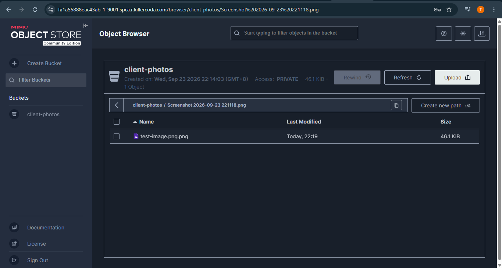

# MinIO Deployment

## Docker Command

The following Docker command was used to download and start the MinIO server:

```bash
docker run -d -p 9000:9000 -p 9001:9001 --name minio-server \
-e "MINIO_ROOT_USER=cloudadmin" \
-e "MINIO_ROOT_PASSWORD=CloudNova2026!" \
quay.io/minio/minio server /data --console-address ":9001"
```

## Verify the Container

After running the command, I verified that the MinIO container was running using:

```bash
docker ps
```

The `minio-server` container was displayed in the list of running containers.

## Web Console Port

The MinIO Web Console was accessed using **port 9001**.

Port **9000** is used for the MinIO API, while port **9001** is used for the Web Console.

## Login Credentials

**Username:** `cloudadmin`

**Password:** `CloudNova2026!`

## Environment Variables

The `-e` flags in the Docker command are used to set environment variables inside the MinIO container.

* `MINIO_ROOT_USER=cloudadmin` sets the administrator username.
* `MINIO_ROOT_PASSWORD=CloudNova2026!` sets the administrator password.

These credentials were used to log in to the MinIO Web Console.

## Bucket Created

I created a bucket named:

```text
client-photos
```

I then uploaded a sample file into the bucket to verify that the object storage server was working properly.

## Screenshots

### MinIO Deployment


### Bucket and Uploaded File


